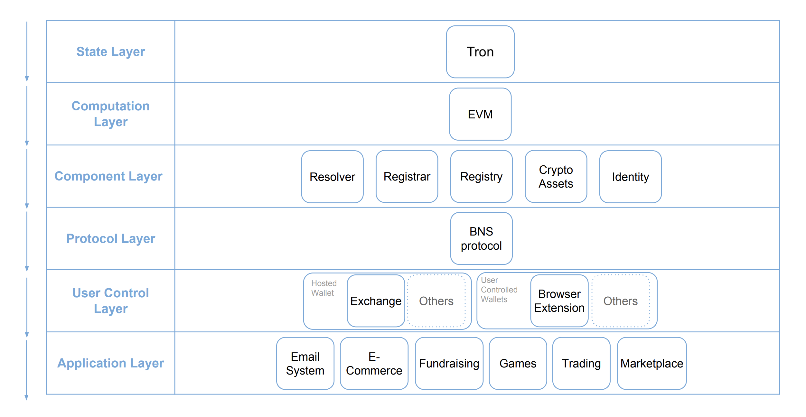
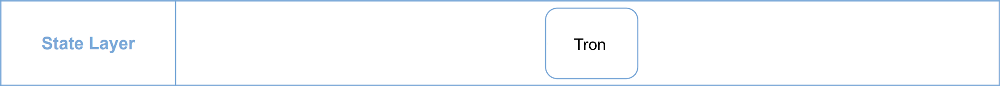
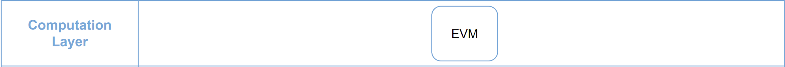
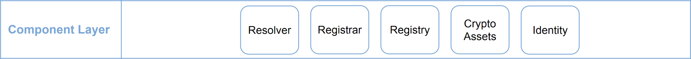
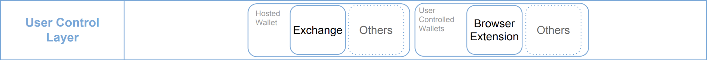
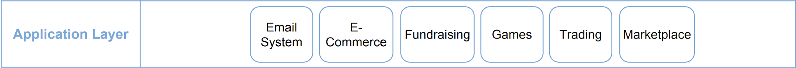

> 📖🔍 Documents of the Tron Name Service.

## 💡 What is BNS?
BNS – or blockchain name system – is the protocol on the internet that turns human-comprehensible decentralized website names such as 'website.trx' or 'mywebsite.trx' into addresses understandable by decentralized network machines.

## 📝 Description

TNS is the Tron Name Service, a distributed, open, and extensible naming system based on the Tron blockchain.

## 📚 Documents

- [Introduction](./docs/INTRODUCTION.md)
- [Implementation](./docs/IMPLEMENTATION.md)
- [Integration](./docs/INTEGRATION.md)

## Tron Technical Stack

### State Layer
State layer is where Tron's user “state”, or user information and behavior, is stored. It is where users have the ability to control their own state.

### Computation Layer
Tron uses EVM (Ethereum Virtual Machine) in its computation layer, which is responsible for executing complicated calculations. It is in charge of managing, checking the code of smart contract on Tron. For instance, when a transaction occurs, the logic designed in EVM will determine its path that cannot be altered, making the smart contracts on Tron immutable and temper-proof. Portal Network will be deploying TNS (Smart Contract Standard) on this layer that consists 3 major components.

### Component Layer
The design of digital assets can have more functions through combing the State Layer and Computation Layer, such as : crypto assets, and identities. Those programmable assets has many more potential usages and sub-economies within. TNS includes three major component: a `registry`, a `registrar`, and a `resolver`.

A `registry` component stores all the information relative to a domain, and can operate the set of logics to map between the Tron domains and its owners.
A `registrar` component governs the domain purchase through the customized auction or trading rules.
A `resolver` component processes the corresponding resources from wallet address to decentralized application or website on Tron.

### Protocol Layer
On the Protocol Layer, we will be presenting our BNS (Blockchain Name Service) standards that can make the TNS more efficient and applicable. This layer integrate the logic behind TNS (computation layer and component layer), and presents a gateway for users and developers to use and interact.

### User Control Layer
User control layer is in charge of managing private keys to communicate with the state layer. TNS is completely decentralized, and governed by smart contracts, which allows users to have full control over their domains. Users can control, set up, and manage their digital asset with an easier and readable text.

### Application Layer
TNS can be easily implemented into any of the services or application on Tron who wish to make decentralized user experience better. For instance, wallet that can resolve TNS will allow users to easily send or receive Tron Token (TRX); dApp that utilize TNS will enable users to have their own digital identity that are more meaningful and valuable. We believe that TNS is an essential components to provide a better environment for both technical and non-technical users. 

## 📣 Contributing
See [CONTRIBUTING.md](./CONTRIBUTING.md) for how to help out.

## 🗒 Licence
See [LICENSE](./LICENSE) for details.
