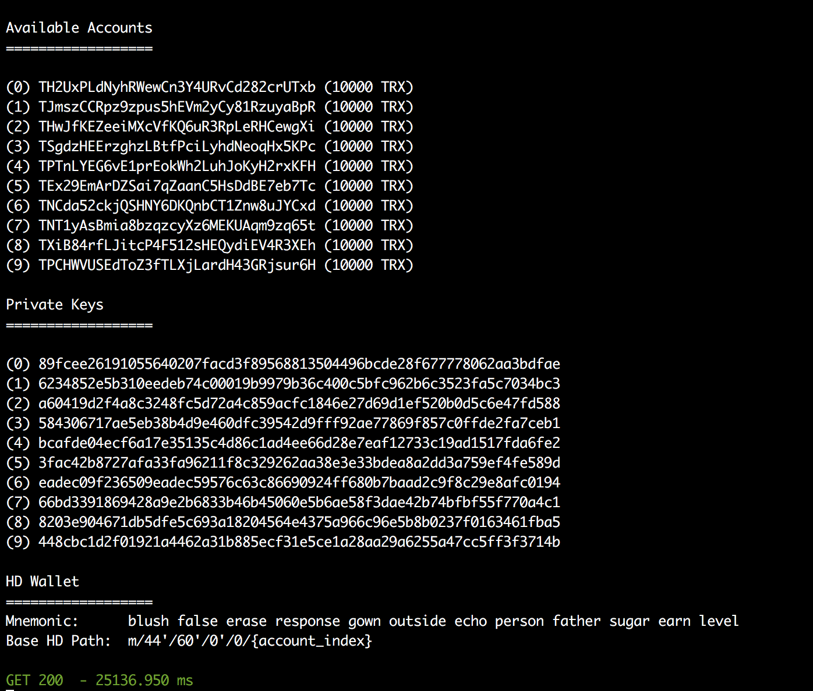

# Tron Name Service

Implementations for smart contracts for the TomoChain Name Service.

## Techincal Stack

- Use `tronbox` to create, compile, deploy and test smart contract.
- Use `open zeppelin` for smart contract security.
- Use `tronweb` for tron library.
- Use `docker` to start Tron local test node.

## Install the project dependency

Install `tronbox`

```
npm i -g tronbox
```

## Local testing

Start docker

```
docker run -it --rm -p 9090:9090 --name tron trontools/quickstart
```



Run test
```
tronbox test
```
